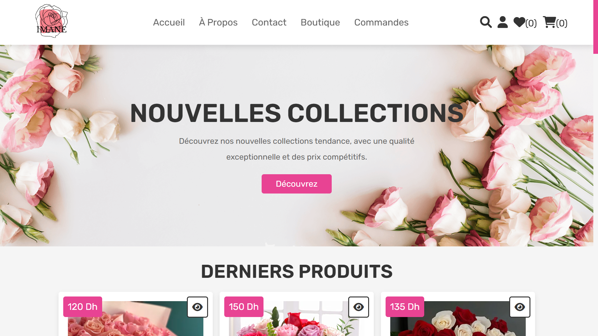
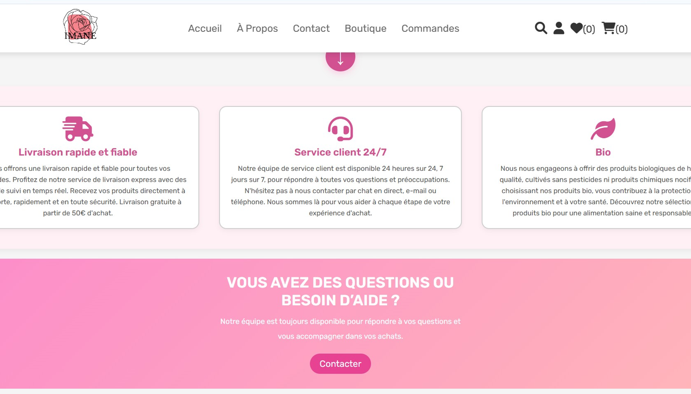
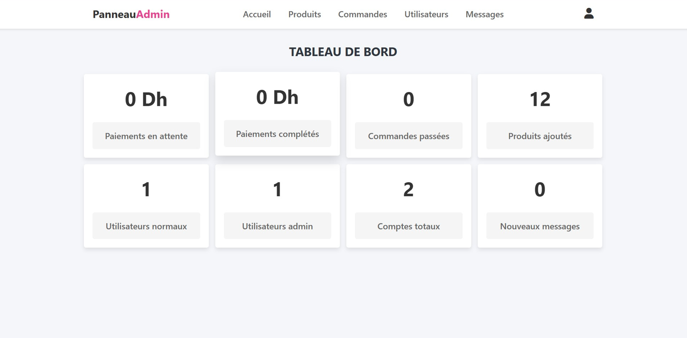
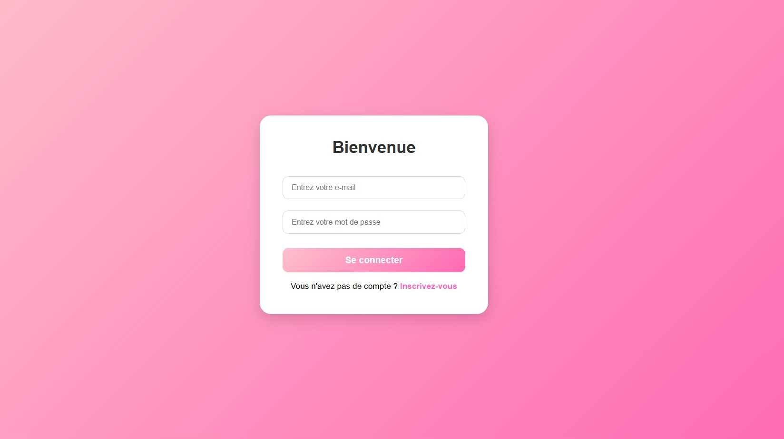
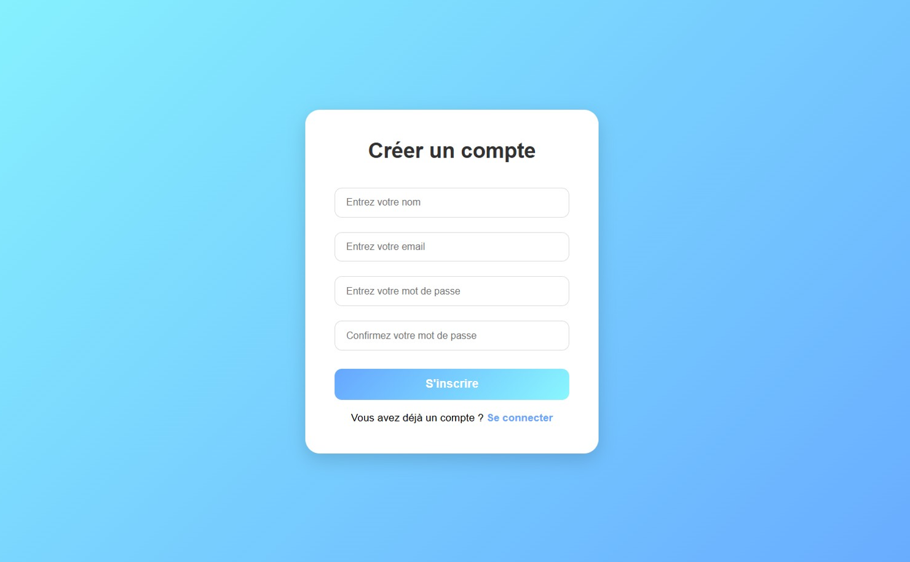
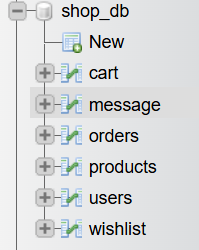
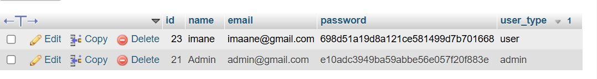

# 🎓 PFE – Dynamic E-commerce Website

## 📌 Description

This project is a dynamic e-commerce website developed as a Final Year Project (PFE).
It is built using PHP and MySQL and allows users to browse products, register, and place orders.

## 🛠 Admin Panel

The project includes an admin panel that allows the administrator to:

- Manage products (add, edit, delete)
- View and manage orders
- Manage users
- Control website content

## 📸 Screenshots

### 🏠 Home Page

### 🛠 Admin Panel

### 🔐 Login Page

### 🔐 Register Page

----

### 🔐 Data base

### 🔐 Users

